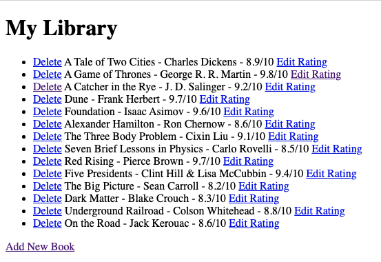

# Library - Python 

  ## Description

  Library is a very simple web application built with Python, Flask, and SQLAlchemy.
  The app allows users to add a book to the Library including the title, author, and rating.  
  Users can subsequently edit the rating or delete a book from the Library.  Data is persistent 
  as it utilizes an SQLite database.

  Screenshot below:

  
  ## Table of Contents
  
  - [Installation](#installation)
  - [Usage](#usage)
  - [License](#license)
  - [Contributing](#contributing)
  - [Tests](#tests)
  - [Questions](#questions)
  
  ## Installation
  
  run main.py from command line
  
  ## Usage
  
  go to http://localhost:5000.  Click "Add New Book" to add a new book to the Library.
  Click to "delete" to delete a book or "Edit Rating" to edit the rating.

  ## License
This application is covered under the MIT License.
 For more information: https://opensource.org/licenses/MIT
  
  ## Contributing
  N/A
  
  ## Tests
  N/A

  ## Questions
  Contact Info 
  GitHub user name: BillStephens2022 
  Link to GitHub profile: https://github.com/BillStephens2022 
  Email: stephensbill17@gmail.com
